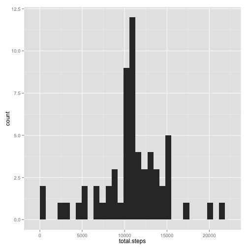
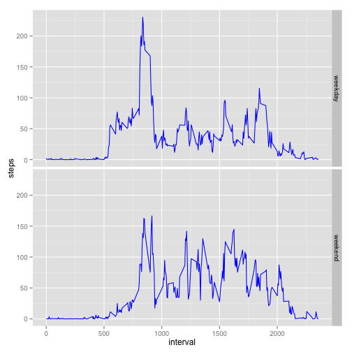

# Reproducible Research: Peer Assessment 1


## Loading and preprocessing the data


```r
install.packages("ggplot2")
```

```
## Error: trying to use CRAN without setting a mirror
```

```r
library(ggplot2)

activity <- read.csv("activity.csv")
```

## What is mean total number of steps taken per day?


```r
# 1
day.sums <- aggregate(list(total.steps = activity$steps), by = list(date = activity$date), 
    FUN = sum, na.rm = TRUE)

qplot(total.steps, data = day.sums)
```

```
## stat_bin: binwidth defaulted to range/30. Use 'binwidth = x' to adjust this.
```

 

```r

# 2
mean(day.sums$total.steps)
```

```
## [1] 9354
```

```r
median(day.sums$total.steps)
```

```
## [1] 10395
```

## What is the average daily activity pattern?

```r
# 1
interval.means <- aggregate(list(steps = activity$steps), by = list(interval = activity$interval), 
    FUN = mean, na.rm = TRUE)

with(interval.means, plot(interval, steps, type = "l"))
```

 

```r


# 2
max.interval = interval.means[interval.means$steps == max(interval.means$steps), 
    "interval"]
```

## Inputing missing values

The means for the given interval are used to replace missing values.


```r
# 1
sum(is.na(activity$steps))
```

```
## [1] 2304
```

```r

# 2 and 3


intervals <- activity[is.na(activity$steps), "interval"]

rownames(interval.means) <- interval.means[, 1]
interval.means[, 1] <- NULL

activity.filled <- activity
activity.filled[is.na(activity$steps), "steps"] <- interval.means[as.character(intervals), 
    ]

# 4

day.sums.filled <- aggregate(list(total.steps = activity.filled$steps), by = list(date = activity.filled$date), 
    FUN = sum, na.rm = TRUE)


qplot(total.steps, data = day.sums.filled)
```

```
## stat_bin: binwidth defaulted to range/30. Use 'binwidth = x' to adjust this.
```

 

```r

mean(day.sums.filled$total.steps)
```

```
## [1] 10766
```

```r
median(day.sums.filled$total.steps)
```

```
## [1] 10766
```

## Are there differences in activity patterns between weekdays and weekends?

```r
activity.filled$is.weekend <- "weekday"

vec <- weekdays(as.Date(activity.filled$date)) %in% c("Saturday", "Sunday")
activity.filled$is.weekend[vec] = "weekend"

# 2


interval.means.filled <- aggregate(list(steps = activity.filled$steps), by = list(interval = activity.filled$interval, 
    is.weekend = activity.filled$is.weekend), FUN = mean, na.rm = TRUE)


p <- ggplot(interval.means.filled, aes(interval, steps)) + geom_line(color = "blue")

p + facet_grid(is.weekend ~ .)
```

 

